# Jupyter Notebook Server on AWS Using Putty for Windows
## 1.	Download Putty:
a. 32 bit: https://the.earth.li/~sgtatham/putty/latest/w32/putty.exe 
b.	64 bit: https://the.earth.li/~sgtatham/putty/latest/w64/putty.exe 
## 2.	Download Puttygen:
a.	32 bit: https://the.earth.li/~sgtatham/putty/latest/w32/puttygen.exe 
b.	64 bit: https://the.earth.li/~sgtatham/putty/latest/w64/puttygen.exe 
## 3. Create Private Key Using Puttygen:
#### a.	Open Puttygen and Click on Load:
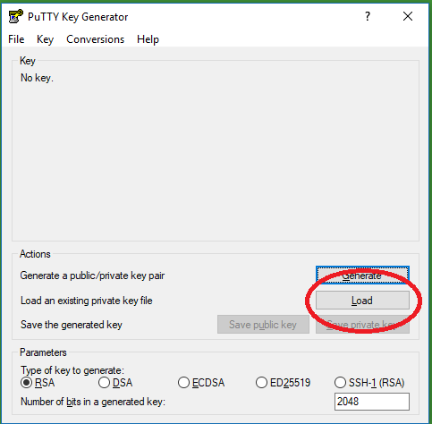
#### b.	Change Putty Private Key Files(*.ppk) to All Files:
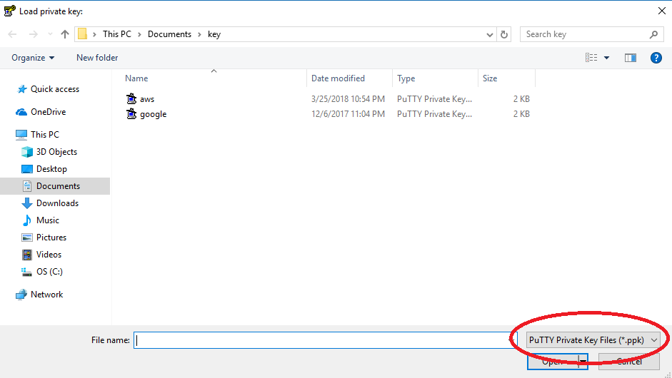
#### c.	Navigate your AWS  *.pem key and Click Open:
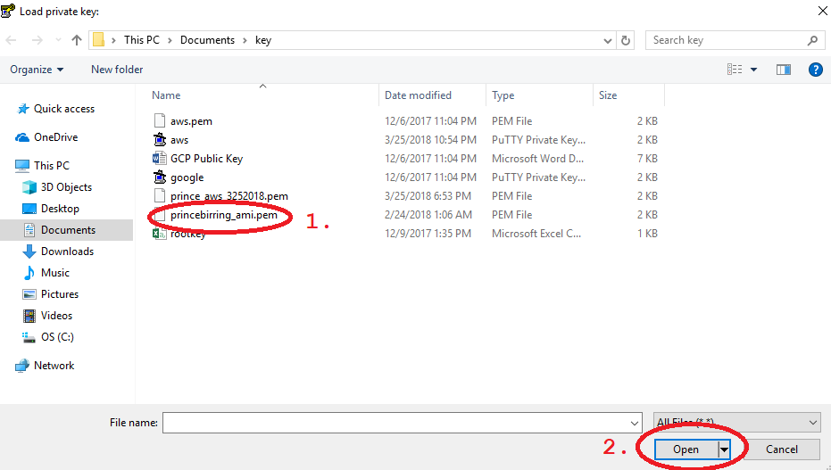
#### d.	Click OK:
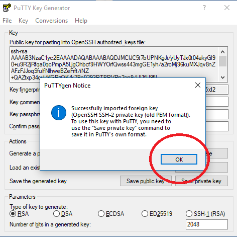
#### e.	Click on Save Private Key:
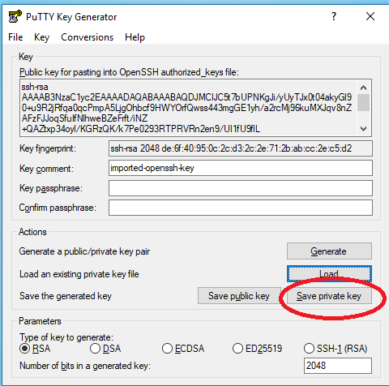
#### f. Click YES:
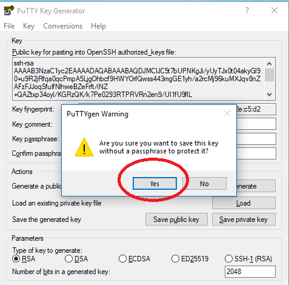
#### g. Click Save:
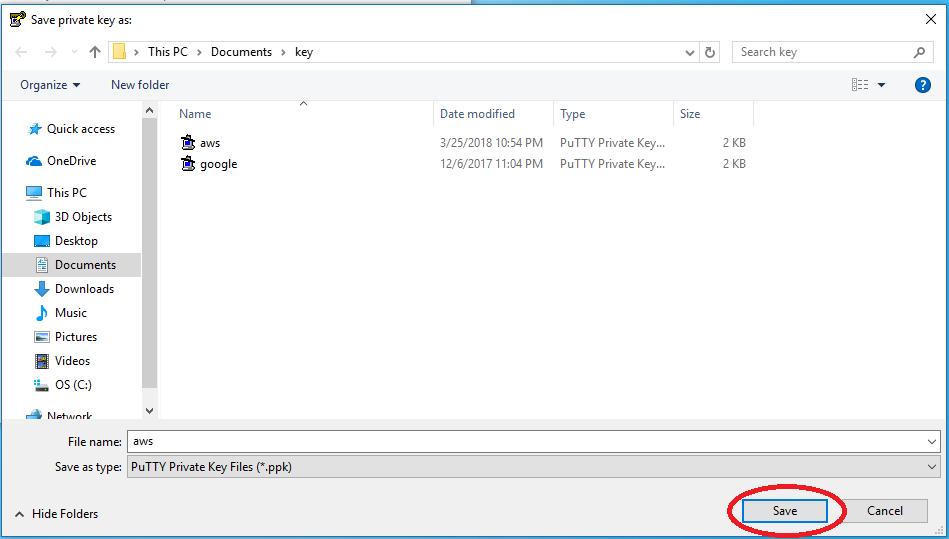
### 4. Connect to AWS Using Putty:
#### a. Open Putty:
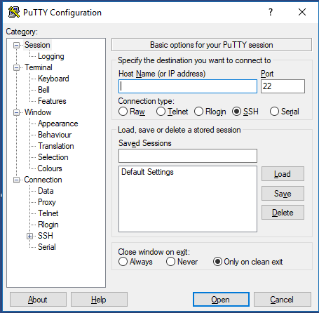
#### b. Copy Username-Public DNS from AWS:
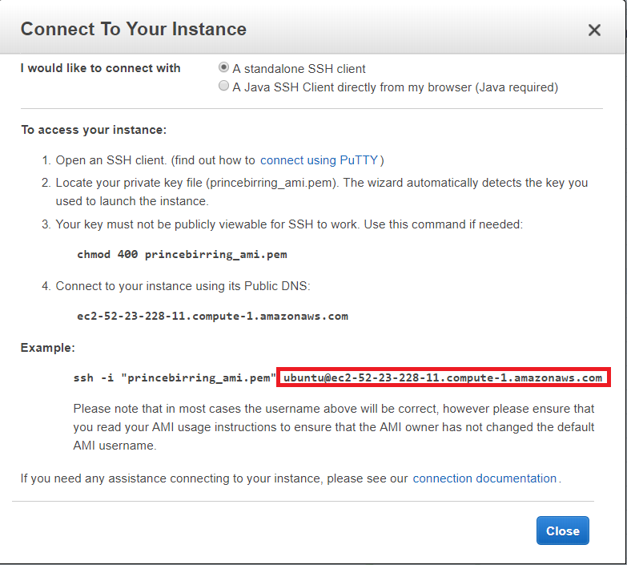
#### c. Paste the Username-Public DNS in Host Name(for IP address):
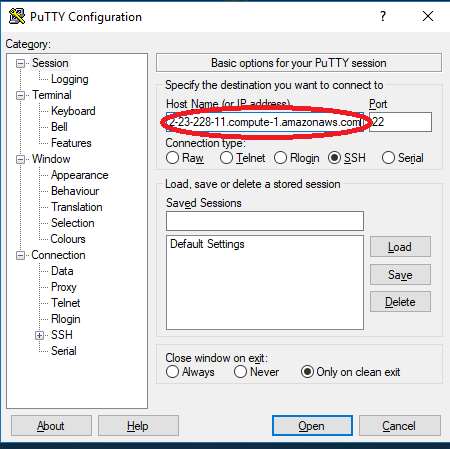
#### d. Click SSH and then Auth:
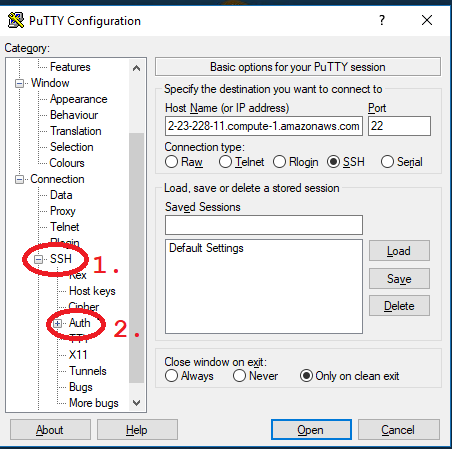
#### e. Browse the *.ppk key which we generate using Puttygen.
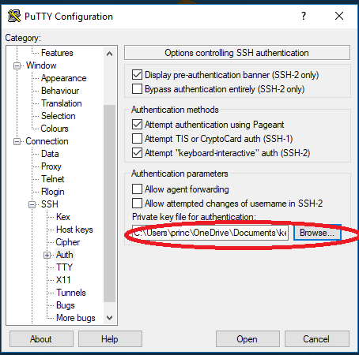
#### f. After selecting the *.ppk key. Click on Tunnels - Put Source Port: 8888 and Destination: 127.0.0.1:8888  
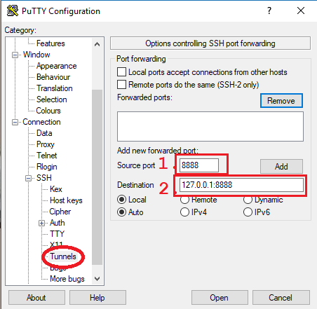
#### g. Click Add after entering Source port and Destiantion.
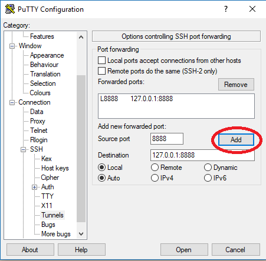
#### h. Click Yes.
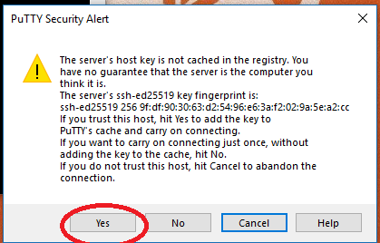
#### i. SSH is Completed if you are able to see the below screeen:
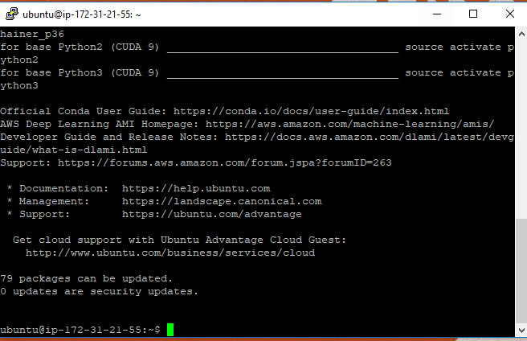
